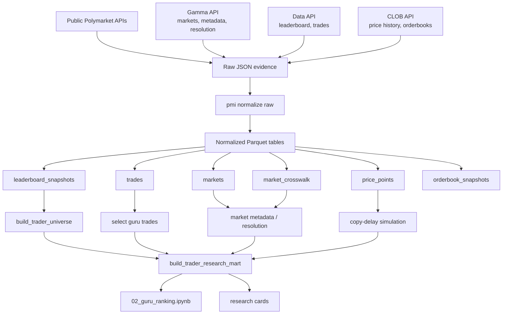
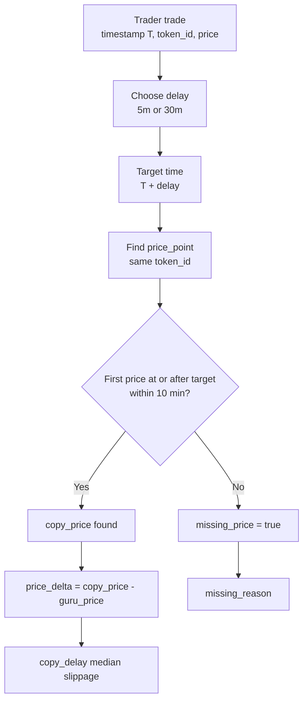

# User Guide

## Installation

```bash
pip install -e ".[dev]"
pmi version
```

No secrets or wallet credentials are required.

## Configuration

Defaults work out of the box. Use `config.example.toml` as the reference for data paths, API base URLs, cache TTLs, and ingestion thresholds. Environment variables can override settings with the `PMI__` prefix.

## Fetch And Normalize

```bash
pmi fetch markets --limit 100 --save-raw
pmi fetch leaderboard --category OVERALL --period MONTH --order-by PNL --save-raw
pmi fetch trades --user 0x... --limit 500 --save-raw
pmi fetch book --token-id <token_id> --save-raw
pmi normalize raw --source all
```

Raw files are permanent evidence. Normalized Parquet tables can be rebuilt from raw.

## Ingestion Jobs

```bash
pmi ingest metadata
pmi ingest leaderboard
pmi ingest orderbook --once
pmi snapshots health
```

Orderbook ingestion tolerates partial failures and records gaps.

## Common Workflows

### Guru Copyability Workflow

This is the main workflow behind `notebooks/02_guru_ranking.ipynb`. It starts with public Polymarket APIs, stores immutable raw evidence, normalizes it into local tables, then builds the `trader_research` mart used by the notebook.



Recommended command sequence:

```bash
pmi research seed --top-n 50 --category OVERALL --period MONTH
pmi normalize raw --source all

pmi research hydrate-trades --include-market-metadata --include-resolution --max-markets 100
pmi normalize raw --source data_api

pmi research hydrate-guru-price-history --category OVERALL --period MONTH --top-n 50 --delays 5m,30m --lookback-minutes 10 --lookahead-minutes 45 --fidelity-minutes 5
pmi normalize raw --source clob

pmi build marts
pmi research price-coverage --category OVERALL --period MONTH --top-n 50
pmi research coverage --explain
pmi snapshots health
```

What each command does:

- `pmi research seed` fetches initial leaderboard and market data.
- `pmi research hydrate-trades` fetches public trades for leaderboard wallets and creates/updates `market_crosswalk`.
- `pmi research hydrate-guru-price-history` fetches CLOB price history for the exact traders and trade timestamps used by the guru notebook.
- `pmi normalize raw` transforms raw API JSON into normalized Parquet tables.
- `pmi build marts` creates `data/marts/trader_research.parquet`.
- `pmi research price-coverage` checks whether top-trader trades have usable T+5m and T+30m prices.
- `pmi research coverage --explain` summarizes global dataset quality.
- `pmi snapshots health` shows storage counts and recent data gaps.

Rank gurus from Python:

```python
from polymarket_insight.research.trader import build_trader_research_mart

trader_research = build_trader_research_mart()
trader_research.sort_values("official_pnl", ascending=False).head(20)
```

Inspect a trader:

```python
from polymarket_insight.data.datasets import traders
trades = traders.trades("0x...")
```

Run copy-delay:

```python
import pandas as pd
from polymarket_insight.analysis.copy_delay import simulate_copy_delay

simulate_copy_delay(
    trades,
    price_points,
    [pd.Timedelta("5m"), pd.Timedelta("30m")],
    tolerance=pd.Timedelta("10m"),
)
```

Copy-delay uses the first price point at or after the target timestamp, within a default 10-minute tolerance.



Missing reasons include:

- `no_price_points_for_token`
- `no_price_after_target`
- `price_after_target_outside_tolerance`
- `token_id_mismatch`

### Price Coverage Diagnostics

Use this before fetching more data to understand whether the issue is missing CLOB history or matching logic:

```bash
pmi research price-coverage --category OVERALL --period MONTH --top-n 50
```

The output includes:

- `total_trades`: trades for the selected leaderboard universe.
- `unique_token_ids`: distinct traded token IDs.
- `token_ids_with_price_points`: traded token IDs that have at least one CLOB price point.
- `token_price_coverage`: token-level price coverage.
- `trades_with_t0_price`: trades with a price point near the original trade time.
- `trades_with_5m_price`: trades with a usable T+5m copy price.
- `trades_with_30m_price`: trades with a usable T+30m copy price.
- `trade_price_coverage_5m`: trade-level T+5m coverage.
- `trade_price_coverage_30m`: trade-level T+30m coverage.
- `missing_price_ratio`: share of simulated copy-delay rows without usable prices.
- `top_missing_token_ids`: token IDs missing most often.
- `zero_coverage_wallets`: wallets with no usable T+5m price coverage.
- `per_wallet`: wallet-level coverage summary.

### Trader Research Mart Columns

The guru notebook reads `data/marts/trader_research.parquet`. Important columns:

- `wallet`: trader wallet from leaderboard data.
- `official_rank`: Polymarket leaderboard rank.
- `official_pnl`: official Polymarket leaderboard PnL. PMI does not recalculate this.
- `official_volume`: official leaderboard volume.
- `trade_count`: number of normalized public trades for the wallet.
- `market_count`: number of unique traded markets.
- `resolved_market_count`: traded markets known to be resolved locally.
- `category_exposure`: dominant category by local trade notional where metadata exists.
- `median_trade_size` / `avg_trade_size`: calculated from normalized trade size.
- `profit_concentration_proxy`: largest market notional divided by total wallet notional.
- `copy_delay_5m_median_slippage`: median delayed-copy price delta at T+5m.
- `copy_delay_30m_median_slippage`: median delayed-copy price delta at T+30m.
- `trade_price_coverage_5m`: share of wallet trades with usable T+5m prices.
- `trade_price_coverage_30m`: share of wallet trades with usable T+30m prices.
- `missing_price_ratio`: wallet-specific missing copy-delay price ratio.
- `coverage_status`: `good`, `partial`, `weak`, or `unusable`.
- `confidence_label`: `high_confidence`, `medium_confidence`, `low_confidence`, or `insufficient_data`.
- `copyability_label`: interim label: `potentially_copyable`, `not_copyable_candidate`, or `inconclusive`.

PMI intentionally avoids final labels like `copyable` until price and resolution coverage are stronger.

Inspect a market:

```python
from polymarket_insight.data.datasets import markets
markets.metadata("<condition_id>")
```

Analyze sports line movement:

```python
from polymarket_insight.research.sports import build_sports_universe, extract_prices_around_anchor
sports = build_sports_universe(league="NBA")
extract_prices_around_anchor(sports)
```

Run reproducible research workflows:

```bash
pmi research run guru-copyability --wallet 0x...
pmi research run sports-line-movement --league NBA
```

Research runs write `manifest.json`, `input_config.json`, `dataset_coverage.json`, `metrics.parquet`, figures, and `research_card.md` under `research_runs/<run_id>/`.

## Research Cards

Use `research/TEMPLATE.md` for every meaningful finding. Be explicit about source, period, gaps, method, result, failure modes, and confidence.

## Troubleshooting

- Empty datasets usually mean no raw data has been fetched or normalized yet.
- Live API errors are saved only when `--save-raw` succeeds; tests use fixtures instead of live calls.
- `pmi snapshots health` reports known gaps from ingestion failures or explicit checks.
